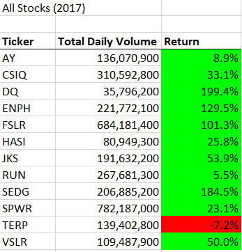
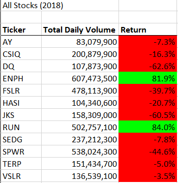
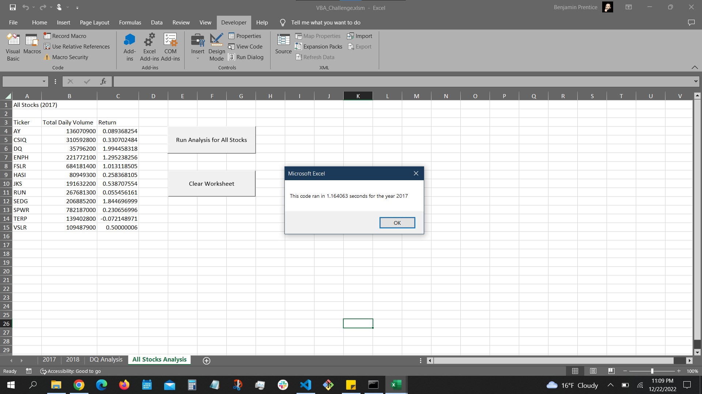
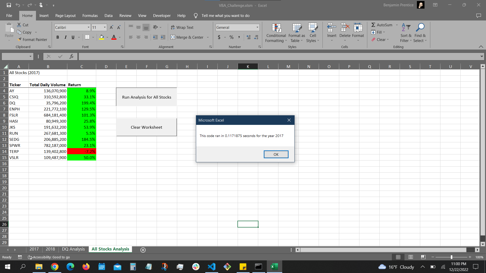
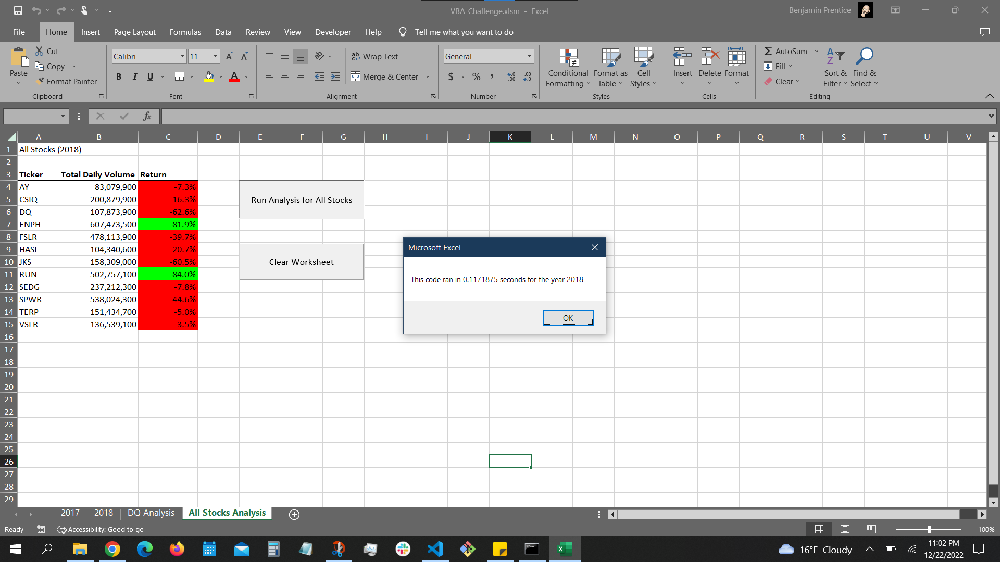

# VBA of Wall Street

## Overview of Project

### Purpose
The client, Steve, requested a programmatic solution to help him analyze multiple
technology stocks. A VBA macro was developed to accomplish the task, and Steve was
pleased with it. Though the VBA macro worked well for a small number of stocks, it
was not suited for analyzing a much larger number of stocks which is what Steve
wanted the code to do for him. In order to meet the client's requirements, the VBA
code was edited - or refactored - to make it run more efficiently.

### Results

## Stock Performance 2017 vs 2018
Stocks performed markedly better in 2017 than in 2018. In 2017, all stocks except one (TERP) saw modest to major gains in value. In 2018, all stocks except for two (ENPH and RUN) saw minor to modest losses.

## Execution Time of Original vs Refactored Scripts

The refactored script executed much faster than the original module script, as seen in the screenshots below:

### Summary

- What are the advantages or disadvantages of refactoring code?
A very quick and dirty internet search came up with a variety of opinions on the pros and cons of refactoring code,
but on balance it seemed that refactoring code was considered a net plus, mostly for the reason that refactoring
usually leads to simpler, cleaner, and easier to read code. A detailed discussion of refactoring, including the
benefits and disadvantages, can be found at this website: https://www.ionos.com/digitalguide/websites/web-development/what-is-refactoring/

- How do these pros and cons apply to refactoring the original VBA script?
In this case, refactoring the code certainly had a positive impact on execution time. The refactored code ran faster on the 2017 and 2018
data than the original code did. One of the benefits of refactoring mentioned on the Ionos website was "Restructuring the source code is possible
without altering the functionality." That was the case here as well; the refactored code accomplished the same thing as the original code, but
executed much faster.

### Acknowledgements
I would not have been able to complete this assignment without the assistance of fellow classmates Andy Kawamoto and Mitch Neuenschwander, as well as
Learning Assistant "Dinnara" on the AskBCS Slack channel. Muchas gracias to all of them.